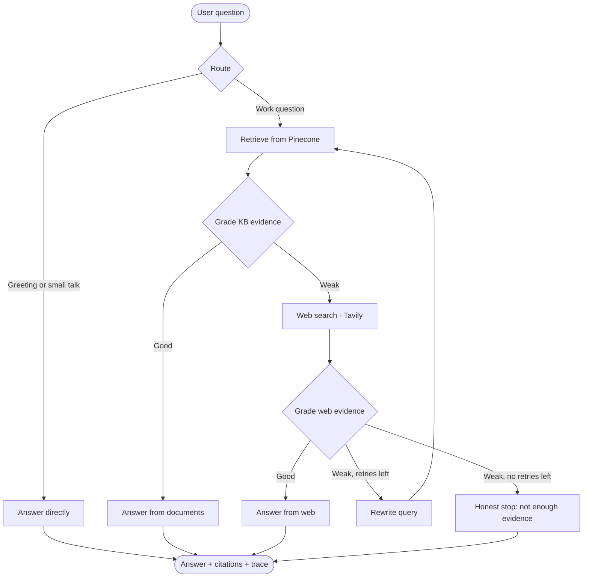
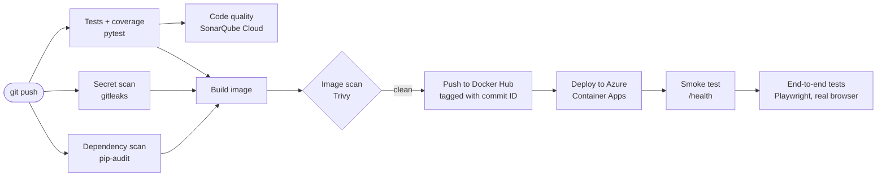
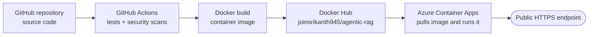

> **Azure edition** of [Wealth-agentic-rag](https://github.com/joinsrikanth945/Wealth-agentic-rag): the same agent, tests and evaluation, with the AI models running on **Azure OpenAI**. One setting switches between OpenAI and Azure OpenAI.


[](https://github.com/joinsrikanth945/Wealth-agentic-rag/actions/workflows/tests.yml)
[](https://sonarcloud.io/summary/new_code?id=joinsrikanth945_Wealth-agentic-rag)
[](https://sonarcloud.io/summary/new_code?id=joinsrikanth945_Wealth-agentic-rag)
[](https://sonarcloud.io/summary/new_code?id=joinsrikanth945_Wealth-agentic-rag)
[](https://sonarcloud.io/summary/new_code?id=joinsrikanth945_Wealth-agentic-rag)

**Live demo:** https://agentic-rag.wittybeach-2baef286.eastus2.azurecontainerapps.io

An agentic Retrieval-Augmented Generation (RAG) assistant that answers staff questions about wealth banking platforms and secure access, using the organization's own documents first and the public web only when the documents fall short.

Built with **LangGraph, FastAPI, OpenAI, Pinecone and Tavily**, with a web interface for chatting, uploading documents and inspecting how the agent reached each answer. Tested with **pytest** and delivered through a **CI/CD and DevSecOps pipeline** (GitHub Actions, SonarQube Cloud, gitleaks, pip-audit, Trivy) that deploys automatically to **Azure Container Apps**.

---

## The problem

Teams supporting a wealth banking platform rely on long vendor guides and configuration documents: client channel guides, front office manuals, authentication setup instructions. Finding the right answer is slow:

- The guides run to hundreds of pages, and keyword search returns too many hits.
- A general-purpose chatbot doesn't know the internal documents and may invent answers.
- Some questions need current public information that the documents don't contain.

## The solution

The assistant reads the organization's documents, finds the passages relevant to a question, **checks whether they actually answer it**, and only then responds, citing its sources. When the documents aren't enough, it searches the web and grades those results too. If neither is good enough, it rewrites the question and tries again, and if it still can't find reliable evidence, it says so instead of guessing.

Example questions for the demo:

- *How long is a client's digital activation link valid?*
- *What happens when an order fails the suitability check?*
- *How do I register a LumenKey token for a new user?*
- *What should I do if a user loses the phone with their token?*
- *How long does an account closure take?* (answered from the scanned document, via OCR)

---

## Knowledge base

Real vendor documentation is proprietary, so **none of it is included in this repository or used by the public demo**. The demo uses fictional sample documents written for this project, about a made-up platform called LumenWealth:

| Document | Covers |
|---|---|
| `advisor_workstation_guide.md` | Front office: client dashboard, orders, suitability checks, risk profiles, compliance tasks |
| `client_channels_guide.md` | Client web portal and mobile app: enrolment, statements, secure messaging, locked accounts |
| `secure_access_token_guide.md` | MFA token app: registration, moving to a new phone, lost devices, common problems |
| `company_it_handbook.md` | Sample internal IT policies |
| `service_desk_runbook.md` | Sample service desk procedures |
| `lumenwealth_fee_schedule_scanned.pdf` | **Scanned** (image-only) document: fees, account closure and portfolio transfers. Readable only through OCR |

All sample documents are in `data/sample_kb/`. To use the assistant with your own documents, upload them through the interface (see [Adding documents](#adding-documents)).

---

## How the agent works

Unlike a basic RAG pipeline, which always retrieves once and answers, this agent decides **how** to answer each question and **checks its own evidence** before responding. The workflow is a LangGraph state graph (`app/rag/workflow.py`):



### Phases

| # | Phase | What happens |
|---|---|---|
| 1 | **Route** | An LLM decides whether the question needs the knowledge base, or is small talk it can answer directly. |
| 2 | **Retrieve** | The question is embedded and the closest document chunks are fetched from Pinecone. |
| 3 | **Grade KB evidence** | An LLM judges whether the chunks are enough to answer confidently. |
| 4 | **Web search** | If the documents are weak, Tavily searches the web. |
| 5 | **Grade web evidence** | The web results are graded too. |
| 6 | **Rewrite & retry** | If both are weak, the question is rewritten and the agent searches the documents again, up to `max_retries`. |
| 7 | **Generate or stop** | The answer is written strictly from the chosen evidence, with citations. If nothing is good enough, the agent says so instead of guessing. |

### The answer paths

- **Direct:** greetings and small talk are answered without retrieval, which saves time and cost.
- **Private knowledge base:** the main path. Answers come only from the documents, with each source file cited once.
- **Web:** the fallback when the documents can't answer, with web pages cited by URL and a note that the information is external.
- **Insufficient evidence:** when neither source is reliable, the agent declines rather than inventing an answer.

The interface shows the **trace** for each answer, so you can see which path the agent took and why. Each request is also logged for auditing.

---

## Ingestion pipeline

Documents go through the same steps whether they come from the sample folder or the upload form:

1. **Load:** text is extracted from PDF, Word (.docx), text and Markdown files; scanned PDF pages and images are read with OCR.
2. **Chunk:** the text is split into small, overlapping passages, so retrieval can return the exact section that answers a question.
3. **Embed:** each chunk is converted to a vector with OpenAI's `text-embedding-3-small`.
4. **Store:** vectors are saved in Pinecone, in the namespace set by `PINECONE_NAMESPACE`. The public demo uses its own `public-demo` namespace, which contains only the sample documents.

**Scanned documents (OCR):** PDF pages with no extractable text, such as scans, are rendered as images and read with **Tesseract OCR**. Normal PDF pages skip OCR, so they stay fast. Image files (`.png`, `.jpg`, `.jpeg`) are OCR'd directly. Chunks produced by OCR are marked with `ocr: true` in their metadata. Accuracy is high for clean, typed scans; handwriting and poor photos are less reliable.

---

## Tech stack

| Layer | Technology |
|---|---|
| Agent workflow | LangGraph, LangChain |
|| LLM | OpenAI `gpt-4o-mini` or Azure OpenAI `gpt-4.1-mini` |
| Embeddings | `text-embedding-3-small` (OpenAI or Azure OpenAI) |
| Vector store | Pinecone |
| Web search | Tavily |
| Backend API | FastAPI, Uvicorn |
| Frontend | HTML (Jinja2 templates), CSS, JavaScript |
| OCR | Tesseract (pytesseract), pypdfium2 for rendering PDF pages |
| Audit log | SQLite |
| Testing | pytest, pytest-mock, pytest-cov, FastAPI TestClient, Playwright |
| CI/CD | GitHub Actions |
| Code quality | SonarQube Cloud (quality gate, coverage, security hotspots) |
| Security scanning | gitleaks (secrets), pip-audit (dependencies), Trivy (container image) |
| Deployment | Docker, Docker Hub, Azure Container Apps |

---

## Azure OpenAI

The app can use OpenAI directly or Azure OpenAI, chosen by one setting:

| Setting | Value |
|---|---|
| `LLM_PROVIDER` | `openai` (default) or `azure` |
| `AZURE_OPENAI_ENDPOINT` | Endpoint of the Azure OpenAI resource |
| `AZURE_OPENAI_API_KEY` | Key of the Azure OpenAI resource |
| `AZURE_OPENAI_API_VERSION` | For example `2024-10-21` |
| `AZURE_OPENAI_CHAT_DEPLOYMENT` | Chat model deployment, for example `gpt-4.1-mini` |
| `AZURE_OPENAI_EMBEDDING_DEPLOYMENT` | Embedding deployment, for example `text-embedding-3-small` |

**Setup in Azure:** create an Azure OpenAI resource, then deploy a chat model and `text-embedding-3-small` in Azure AI Foundry. The embedding model is the same as on OpenAI (1536 dimensions), so the existing Pinecone data works without re-ingesting.

**Model note:** `gpt-4o-mini` is being retired on Azure, so this edition uses `gpt-4.1-mini`.

### Results

| Provider | Chat model | Evaluation |
|---|---|---|
| OpenAI | gpt-4o-mini | 18/18 |
| Azure OpenAI | gpt-4.1-mini | 18/18 |

Both providers pass every case. On the trap question, gpt-4.1-mini used web search where gpt-4o-mini stopped with "insufficient evidence"; neither invented a fee. Re-running the evaluation after a model change catches behavior changes like this.


## Project structure

```
Wealth-agentic-rag/
├── app/
│   ├── api/routes.py          # API endpoints: chat, upload, health, audit
│   ├── core/config.py         # Settings loaded from .env
│   ├── core/logging.py        # Logging setup
│   ├── rag/state.py           # Shared state passed between agent steps
│   ├── rag/workflow.py        # LangGraph workflow: route, retrieve, grade, search, rewrite, generate
│   ├── rag/vectorstore.py     # Embeddings, Pinecone connection, retriever
│   ├── services/ingestion.py  # Document loading and chunking
│   ├── services/audit.py      # Audit logging
│   └── main.py                # FastAPI app, templates and static files
├── data/sample_kb/            # Fictional sample documents loaded by ingest_sample_kb.py
├── tests/                     # pytest test suite
│   └── eval/                  # answer-quality evaluation: questions, scorer, runner, report
├── .github/workflows/tests.yml # CI/CD pipeline: tests, Sonar, security scans, build, deploy
├── templates/index.html       # Web interface
├── static/                    # CSS and JavaScript for the interface
├── ingest_sample_kb.py        # Loads the sample documents into Pinecone
├── run.py                     # Starts the server
├── Dockerfile                 # Hardened image: patched OS packages, pip removed at runtime
├── requirements.txt
├── pytest.ini                 # pytest configuration
├── sonar-project.properties   # SonarQube Cloud settings
└── .env.example               # Settings template
```

---

## Getting started

### Prerequisites

- Python 3.11
- [Tesseract OCR](https://github.com/tesseract-ocr/tesseract), for scanned documents (Windows: `scoop install tesseract`; Linux: `apt-get install tesseract-ocr`)
- API keys for [OpenAI](https://platform.openai.com/), [Pinecone](https://www.pinecone.io/) and [Tavily](https://tavily.com/)

### 1. Set up the environment

```powershell
git clone https://github.com/joinsrikanth945/Wealth-agentic-rag.git
cd Wealth-agentic-rag
python -m venv .venv
.\.venv\Scripts\Activate.ps1        # macOS/Linux: source .venv/bin/activate
pip install -r requirements.txt
```

### 2. Configure

Copy the template and fill in your keys:

```powershell
Copy-Item .env.example .env         # macOS/Linux: cp .env.example .env
```

| Setting | Required | Description |
|---|---|---|
| `OPENAI_API_KEY` | Yes | Used for the LLM and embeddings |
| `PINECONE_API_KEY` | Yes | Vector store |
| `TAVILY_API_KEY` | Yes | Web search fallback |
| `ADMIN_API_KEY` | Recommended | Password for uploading documents (default: `change-me`) |
| `PINECONE_NAMESPACE` | No | Pinecone namespace to read and write (default in `app/core/config.py`) |
| `APP_NAME` | No | Name shown in the interface |

Other defaults (index name, models, retry limit) are in `app/core/config.py` and can be overridden in `.env`.

### 3. Load the sample documents

```powershell
python ingest_sample_kb.py
```

### 4. Run

```powershell
python run.py
```

Open **http://127.0.0.1:8080**. The interactive API documentation is at **http://127.0.0.1:8080/docs**.

### Docker

```powershell
docker build -t agentic-rag .
docker run -p 8080:8080 --env-file .env agentic-rag
```

---

## Adding documents

1. Open the app and go to **Add Company Document**.
2. Choose a PDF (including scanned PDFs), Word (.docx), text, Markdown or image (.png, .jpg) file.
3. Enter the admin key and click **Index Document**.

The file is chunked, embedded and stored in Pinecone immediately, and is available for questions straight away. Older `.doc` files must be saved as `.docx` first.

---

## Testing

The project has 45 automated tests, run with pytest on every push through GitHub Actions, with coverage reported to SonarQube Cloud.

| Layer | File | What it checks |
|---|---|---|
| Ingestion | `tests/test_ingestion.py` | Loading text, Markdown and Word files; chunking; source tracking; OCR of scanned PDFs and images (using a generated scan with known text); normal PDFs skip OCR |
| API | `tests/test_api.py` | Health check, home page, chat error handling, upload security (admin key) and file-type validation |
| Agent workflow | `tests/test_workflow.py` | Every routing decision and path: direct answer, documents, web fallback, query rewrite and retry, honest stop |

The workflow tests replace OpenAI, Pinecone and Tavily with fakes that return scripted answers, so they are fast, free and deterministic, and need no API keys.

| End-to-end (browser) | `tests/e2e/test_demo_e2e.py` | 5 Playwright tests in a real Chromium browser against the deployed app: page loads, a document answer with citation and trace, a direct answer, the issue #1 trap question, and upload refused without the admin key. Run after every deployment |
| Evaluation scorer | `tests/test_eval_scoring.py` | The answer-quality scorer itself: it must fail wrong facts, wrong sources, wrong paths, ungrounded answers and invented figures |

Run them locally:

```bash
pip install pytest pytest-mock httpx pytest-cov
pytest -v
pytest --cov=app --cov-report=term    # with a coverage report
```

The end-to-end tests are skipped unless `E2E_BASE_URL` is set. To run them against the live demo (a few real LLM calls, about 1–2 cents):

```bash
pip install pytest-playwright
python -m playwright install chromium
E2E_BASE_URL=https://agentic-rag.wittybeach-2baef286.eastus2.azurecontainerapps.io pytest tests/e2e -v
```

---

## Answer-quality evaluation

The automated tests check the agent's **logic** with a fake LLM. The evaluation checks the **real system's answers**: it asks the live agent (real OpenAI, Pinecone and Tavily) questions whose correct answers are known, and scores every answer.

```bash
python tests/eval/run_eval.py                  # all cases, public-demo namespace
python tests/eval/run_eval.py --only scanned   # only the scanned-document cases
```

**What each case checks** (`tests/eval/questions.yaml`)

| Check | Question it answers |
|---|---|
| Facts | Does the answer contain the expected facts, e.g. "10 business days"? |
| Source | Does it cite the right document? |
| Path | Did the agent take the expected route: documents, web, direct, or "not enough evidence"? |
| Grounded | Do the expected facts appear in the chunks the agent actually retrieved, so the answer comes from the source and not from the model's memory? |
| No invention | On trap questions the documents don't cover, does the agent avoid inventing a figure? |

The set covers every sample document, including facts that exist only in the **scanned PDF** (proving OCR end to end), routing cases, and trap questions. Each run writes `tests/eval/eval_report.md` with the date, commit, a per-case table and the full answer for every failure, and exits with an error if the pass rate is below the threshold (85% by default), so it can serve as a quality gate.

The evaluation never runs with plain `pytest` or in the CI pipeline, because it uses the real APIs: one run costs a few cents. The scorer itself is unit-tested for free in `tests/test_eval_scoring.py`.

---

## CI/CD and DevSecOps pipeline

Every push to `main` runs the pipeline in `.github/workflows/tests.yml`. Each stage only runs if the previous ones pass, so a failing test or a security finding never reaches the live demo.



| Stage | Tool | Blocks deployment when |
|---|---|---|
| Tests | pytest | Any of the 45 tests fails |
| Code quality | SonarQube Cloud | Reported only (quality gate visible in the badge) |
| Secret scan | gitleaks | A password or key is found anywhere in the repository history |
| Dependency scan | pip-audit | A Python dependency has a known vulnerability |
| Image scan | Trivy | The Docker image has a HIGH or CRITICAL vulnerability with a fix available |
| Deploy | Azure CLI | The Container App cannot be updated |
| Smoke test | curl | The live app does not respond within about 3 minutes |
| End-to-end | Playwright (Chromium) | A user flow fails in the deployed app; screenshots and a trace recording of failed tests are attached to the run |

**Safeguards**

- Pull requests run the checks but never deploy.
- Documentation-only changes (README, LICENSE, screenshots) do not trigger a rebuild.
- Only one pipeline runs at a time.
- Each image is tagged with its commit ID, so every live version traces back to exact code and can be rolled back.
- Credentials are stored as encrypted GitHub secrets: a Docker Hub access token, and an Azure service principal scoped to the project's resource group only. The application's API keys stay in Azure and never pass through GitHub.

**What the scans found and fixed**

When the security checks were first enabled, pip-audit reported 37 known vulnerabilities in 6 packages (including Starlette, python-multipart, pypdf and langchain). Upgrading them broke the home page and seven API tests; the test suite caught this before deployment, the code was fixed, and a home page test was added. Trivy then flagged vulnerable packages bundled inside pip itself, which the application never uses, so the Dockerfile now removes pip from the runtime image and patches the base image's system packages.

---

## Deployment

The app runs on **Azure Container Apps**, using a Docker image published to **Docker Hub**. Releases are automatic: the CI/CD pipeline builds, scans and deploys every push to `main` that passes all checks.



### How it is set up

| Component | Choice | Why |
|---|---|---|
| Source control and CI/CD | GitHub, GitHub Actions | Version history; tests, scans and deployment on every push |
| Packaging | Docker (`python:3.11-slim` base) | Same environment locally and in the cloud |
| Image registry | Docker Hub (public) | Free hosting for the image |
| Hosting | Azure Container Apps (Consumption plan) | Serverless containers, HTTPS included |
| Scaling | 0 to 1 replicas | Scales to zero when idle, so it stays within the free monthly allowance |
| Resources | 0.5 vCPU, 1 GiB memory | Enough for LangGraph and document processing |
| Configuration | Container App secrets | API keys are kept out of the image and the repository |
| Data | Separate `public-demo` namespace | The public demo can only reach the sample documents |

### Initial setup (one time)

These steps created the Azure resources. After that, the pipeline handles every release.


1. **Build the image** from the project folder:

   ```bash
   docker build -t agentic-rag .
   ```

2. **Push it to Docker Hub:**

   ```bash
   docker tag agentic-rag joinsrikanth945/agentic-rag:v1
   docker push joinsrikanth945/agentic-rag:v1
   ```

3. **Create the Azure environment:**

   ```bash
   az group create --name agentic-rag-rg --location eastus2
   az containerapp env create --name agentic-rag-env --resource-group agentic-rag-rg \
     --location eastus2 --logs-destination none
   ```

4. **Deploy the container app**, with API keys passed as secrets:

   ```bash
   az containerapp create --name agentic-rag --resource-group agentic-rag-rg \
     --environment agentic-rag-env \
     --image docker.io/joinsrikanth945/agentic-rag:v1 \
     --target-port 8080 --ingress external \
     --cpu 0.5 --memory 1.0Gi --min-replicas 0 --max-replicas 1 \
     --secrets openai-key=<key> pinecone-key=<key> tavily-key=<key> admin-key=<password> \
     --env-vars OPENAI_API_KEY=secretref:openai-key PINECONE_API_KEY=secretref:pinecone-key \
                TAVILY_API_KEY=secretref:tavily-key ADMIN_API_KEY=secretref:admin-key \
                PINECONE_NAMESPACE=public-demo
   ```

### Releasing a new version

**Automatically (default):** push to `main`. The pipeline tests, scans, builds the image tagged with the commit ID, deploys it and runs a smoke test. Progress is visible in the repository's **Actions** tab.

**Manually (fallback):** if the pipeline is unavailable, a release can still be done by hand:

```bash
docker build -t agentic-rag .
docker tag agentic-rag joinsrikanth945/agentic-rag:v2
docker push joinsrikanth945/agentic-rag:v2
az containerapp update --name agentic-rag --resource-group agentic-rag-rg \
  --image docker.io/joinsrikanth945/agentic-rag:v2
```

Each release uses a new image tag, so Azure keeps a revision history and older versions can be restored, for example by redeploying an earlier commit's image tag.

### Notes

- **Cold starts:** after a period without traffic, the app scales to zero, so the first request takes a few seconds while it starts.
- **Storage:** indexed documents live in Pinecone and persist across restarts. Files saved inside the container and the audit log are temporary on this setup.
- **Cost control:** the OpenAI account has a monthly spending limit, and the Azure subscription has a budget alert.

---

## Roadmap

- **BDD scenarios:** agent behaviours described as Given/When/Then scenarios with pytest-bdd.
- **Blocking quality gate:** make the SonarQube Cloud quality gate block deployment.
- **Incremental ingestion:** process only new or changed files, with fixed chunk IDs to prevent duplicates.
- **Document sources:** sync from Google Drive, Shared Drives or network folders.
- **Rate limiting:** limit questions per visitor on the public demo.
- **Access control:** restrict documents by team or role.

---

## Acknowledgements and license

This project builds on an open-source Agentic RAG project, adapted to the wealth banking domain, extended with a test suite and a CI/CD and DevSecOps pipeline, and deployed to Azure. See [LICENSE](LICENSE) for the license and original copyright.
